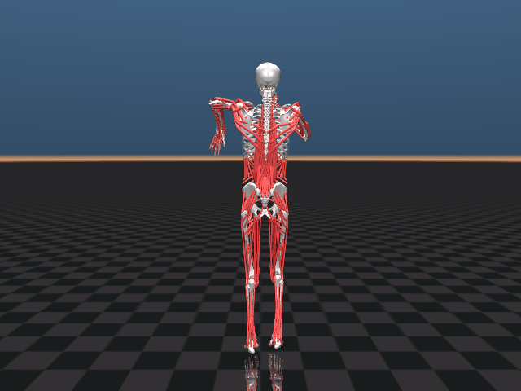
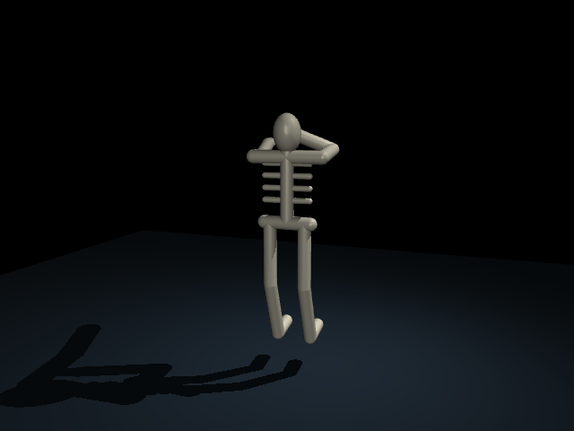

# Me trying to learn MuJoCo so I can make cool simulations


## My Goal
Make the skeleton hit **the scuba** :D

(yes, an actual musculoskeletal model doing the scuba. it's ambitious. it's fun. that's the point.)

## Where I'm at
- [x] Falling box: got the basic model → data → step loop working
- [x] Pendulum on a hinge: driving a joint with `data.ctrl`
- [x] Sine-wave control: making MY command create the motion, not gravity
- [x] Loaded a real MyoSuite elbow: drove an actual muscle to flex rhythmically using a pre-constructed model
- [x] Drive multiple muscles together (agonist/antagonist pairs)
- [x] Load a bigger/full-body model (simplified supported skeleton)
- [x] Hand-author a coordinated motion (scuba attempt #1)
- [ ] Train it properly (RL/motion targets) for a real scuba

## What I've learned so far
- MuJoCo is just the **body** (physics). My Python is the **brain** that sends commands each step
- A constant command moves a limb once then holds. *Ongoing* motion needs a command that changes over time
- A "relaxed" limb still moves, because gravity and passive tendon tension are always acting
- Muscle activation (0-1) is the command for a real muscle, not raw torque
- When my eyes can't see the motion, `qpos` shows it in numbers

## Files
- `arm.py` - falling box + first pendulum
- `pendulum_rhythm.py` - sine-wave driven pendulum (with notes)
- `myo_model.py` - driving a real MyoSuite elbow muscle


## Anatomical MyoSim scuba — real muscle model



`myo_scuba.py` uses the official [MyoSim](https://github.com/MyoHub/myo_sim)
`myofullbody` model, the anatomical model library used by
[MyoSuite](https://github.com/MyoHub/myosuite). It composes the real bone meshes,
416 muscle actuators, spatial tendon paths, mirrored arms, articulated fingers,
legs, and torso in memory. The anatomy remains in the installed package; no
replacement bone geometry or synthetic joint motors are added.

The pelvis is supported by removing the root free joint. All other joint
couplings and upstream contact pairs remain enabled. The supported model has
122 generalized coordinates. The package's documented inertia floor of
`1e-4 kg·m²` is used for tiny hand bones, and physics runs at a 1 ms timestep.

Dependencies are already installed in this workspace. For a fresh setup:

```bash
python3 -m venv .venv
source .venv/bin/activate
pip install -r requirements-myo.txt
```

Watch on macOS:

```bash
cd ~/Documents/ChatGPT/MuJoCo
.venv/bin/mjpython myo_scuba.py --seconds 20
```

Add `--hide-muscles` to see the bones without tendon lines. On Linux/Windows,
use `python myo_scuba.py --seconds 20` from the activated environment.

```bash
.venv/bin/python myo_scuba.py --headless --seconds 12
.venv/bin/python -m unittest discover -s tests -v
.venv/bin/python render_myo_scuba.py
```

The controller builds collision-aware arm targets, projects computed joint
forces through the anatomical joint couplings, and solves for muscle
excitations bounded between 0 and 1. MuJoCo advances activation and muscle
physics. Inverse kinematics sets reference poses and the initial state only;
it never overwrites joint positions during playback. There are no applied
joint forces or external body forces driving the dance.

The right hand stays near the face with its palm turned toward the nose.
Arm inverse kinematics targets both hand position and palm orientation, using
forearm pronation/supination and the wrist joints. The left hand sweeps horizontally in front
of the chest with its palm facing toward the body, and the knees bend alternately.
The left model is mirrored, so its local palmar normal is +Z rather than the
right hand's -Z; flexor/extensor attachment sites determine each side. Fingers follow neutral reference
angles; this does not yet reproduce an exact nose pinch. This version uses a
computed muscle controller, not the simplified skeleton's PPO checkpoint.
It remains an approximate supported dance, not a validated, freely balancing
human movement. The anatomical simulation may run slower than real time on
some Macs; `--seconds` specifies simulation time.

Rollout data is saved to `results/myo_scuba_rollout.npz`; measured tracking and
hand-motion ranges are saved to [results/myo_scuba_metrics.json](results/myo_scuba_metrics.json).
`render_myo_scuba.py` generates PNG/GIF previews from the muscle-driven physics
and needs a working OpenGL context. The optional anatomical tests check the
actual muscle types, joint couplings, excitation bounds, sustained hand/knee
motion, and torso penetration. The original simplified demo remains available
as `scuba.py` below.

## Scuba attempt #1 — run it



This adds a **simplified full-body MuJoCo skeleton**, with 17 hinge joints and
34 opposing muscle actuators connected through fixed tendons. MuJoCo simulates
muscle activation dynamics and force-length/velocity effects; the controller
commands muscle excitation, not joint positions. Both shoulders include a twist joint so a bent arm can reach around the chest.
Arm–torso collisions are enabled, including explicit upper-arm/spine and rib
contacts. The scripted motion keeps both arms clear of the torso.
The pelvis is fixed, the feet
have no contact forces, and the bones are primitive shapes. This is a learning
model, **not an anatomically validated MyoSuite full-body model**.

The hand-authored interpretation combines a right hand raised toward the face,
a left arm sweeping side to side at nearly constant height, torso sway, head nod,
and alternating bent knees. The left elbow and forward shoulder angle stay
fixed while one shoulder axis oscillates, avoiding the original circular hand path. It is an
approximation of the scuba, without a motion-capture reference. Balance, realistic
muscle paths, fingers pinching the nose, and a validated learned dance remain
future work. The earlier MyoSuite experiments are unchanged.

### Setup

```bash
python3 -m venv .venv
source .venv/bin/activate
pip install -r requirements.txt
```

These requirements run the new scuba workflow. To run the older `myo_*.py`
experiments, also install `myosuite` using its upstream setup instructions.

### Watch or check the scripted dance

On macOS use MuJoCo's Python launcher for the interactive viewer:

```bash
.venv/bin/mjpython scuba.py --seconds 20
```

On Linux/Windows, use `python scuba.py --seconds 20` from the activated environment.
Close the window to stop early. For physics without a graphics window:

```bash
python scuba.py --headless --seconds 12
python -m unittest discover -s tests -v
python render_scuba.py
```

`render_scuba.py` saves a PNG and a four-second looping GIF and requires a working
OpenGL context. Headless physics and training do not require graphics.
Rollouts save joint positions, target angles, muscle excitations, and timestep
to `results/scuba_rollout.npz`, and print tracking RMSE in radians.

### Train muscle coordination

```bash
python train_scuba.py --steps 500000 --seed 7
.venv/bin/mjpython scuba.py --policy results/scuba_ppo.zip --seconds 20
```

The Gymnasium task observes joint position/velocity, muscle activation, target
angles, and motion phase. PPO learns 34 muscle excitations using a tracking reward
with an excitation penalty. Episodes last eight seconds; the scripted PD
controller supplies a comparison, not policy actions during training. Each run
saves a checkpoint and JSON metrics comparing untrained, trained, and scripted
tracking. Increase `--steps` to experiment; training does not guarantee a good
dance. A 100k-step development run is provided locally in `results/scuba_ppo.zip`;
the checkpoint is ignored by Git. Measured results are in
[results/scuba_ppo.json](results/scuba_ppo.json). The final RL milestone stays
unchecked because this supported-model baseline does not establish a realistic,
freely balancing scuba.

### New files

- `models/scuba.xml`: supported skeleton, opposing tendon muscles, floor and light.
- `scuba.py`: motion target, muscle controller, Gymnasium task, viewer and rollout CLI.
- `train_scuba.py`: reproducible PPO training and before/after evaluation.
- `render_scuba.py`: still and animated preview generator.
- `tests/test_scuba.py`: environment contract, target limits, multi-cycle physics, arm clearance, and collision checks.


Shoulder correction: checkpoints trained with the original 15-joint skeleton
are incompatible with the corrected 17-joint model. Retrain using the command
above; the local `results/scuba_ppo.zip` has been regenerated for this model.
