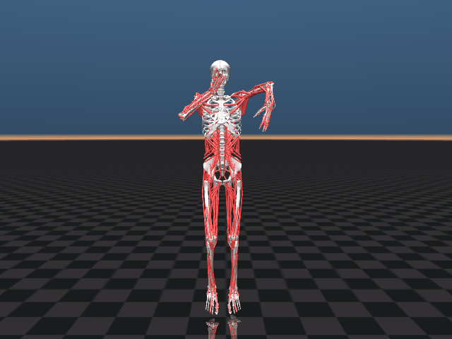

# Anatomical MyoSim scuba

Run the commands below from the repository root.



`myo_scuba.py` uses the official [MyoSim](https://github.com/MyoHub/myo_sim)
`myofullbody` model, the anatomical model library used by
[MyoSuite](https://github.com/MyoHub/myosuite). It composes the real bone meshes,
416 muscle actuators, spatial tendon paths, mirrored arms, articulated fingers,
legs, and torso in memory. The anatomy remains in the installed package; no
replacement bone geometry or synthetic joint motors are added.

The pelvis is supported by removing the root free joint. All other joint
couplings and upstream contact pairs remain enabled. The supported model has
122 generalized coordinates. The package's documented inertia floor of
`1e-4 kg·m²` is used for tiny hand bones, and physics runs at a 1 ms timestep.

For a fresh setup:

```bash
python3 -m venv .venv
source .venv/bin/activate
pip install -r requirements-myo.txt
```

Watch on macOS:

```bash
cd ~/Documents/ChatGPT/MuJoCo
.venv/bin/mjpython myo_scuba.py --seconds 20
```

Add `--hide-muscles` to see the bones without tendon lines. On Linux/Windows,
use `python myo_scuba.py --seconds 20` from the activated environment.

```bash
.venv/bin/python myo_scuba.py --headless --seconds 12
.venv/bin/python -m unittest discover -s tests -v
.venv/bin/python render_myo_scuba.py
```

The controller builds collision-aware arm targets, projects computed joint
forces through the anatomical joint couplings, and solves for muscle
excitations bounded between 0 and 1. MuJoCo advances activation and muscle
physics. Inverse kinematics sets reference poses and the initial state only;
it never overwrites joint positions during playback. There are no applied
joint forces or external body forces driving the dance.

The right hand stays near the face with its palm turned toward the nose.
Arm inverse kinematics targets both hand position and palm orientation, using
forearm pronation/supination and the wrist joints. The left hand sweeps horizontally in front
of the chest with its palm following the torso center, and the knees bend alternately.
A forearm/wrist adjustment turns the sweeping palm inward as the hand moves
out to the side; shoulder and elbow reference poses stay fixed during this
adjustment. Orientation checks use the direction to the chest rather than a
fixed world axis. The viewer and previews open from the front of the skeleton.
The left model is mirrored, so its local palmar normal is +Z rather than the
right hand's -Z; flexor/extensor attachment sites determine each side. Fingers follow neutral reference
angles; this does not yet reproduce an exact nose pinch. This version uses a
computed muscle controller, not the simplified skeleton's PPO checkpoint.
It remains an approximate supported dance, not a validated, freely balancing
human movement. The anatomical simulation may run slower than real time on
some Macs; `--seconds` specifies simulation time.

Rollout data is saved to `results/myo_scuba/myo_scuba_rollout.npz`; measured tracking and
hand-motion ranges are saved to [results/myo_scuba/myo_scuba_metrics.json](../results/myo_scuba/myo_scuba_metrics.json).
`render_myo_scuba.py` generates PNG/GIF previews from the muscle-driven physics
and needs a working OpenGL context. The optional anatomical tests check the
actual muscle types, joint couplings, excitation bounds, sustained hand/knee
motion, and torso penetration. The original simplified demo remains available
as `scuba.py`; see the [simplified demo guide](simplified-scuba.md).
